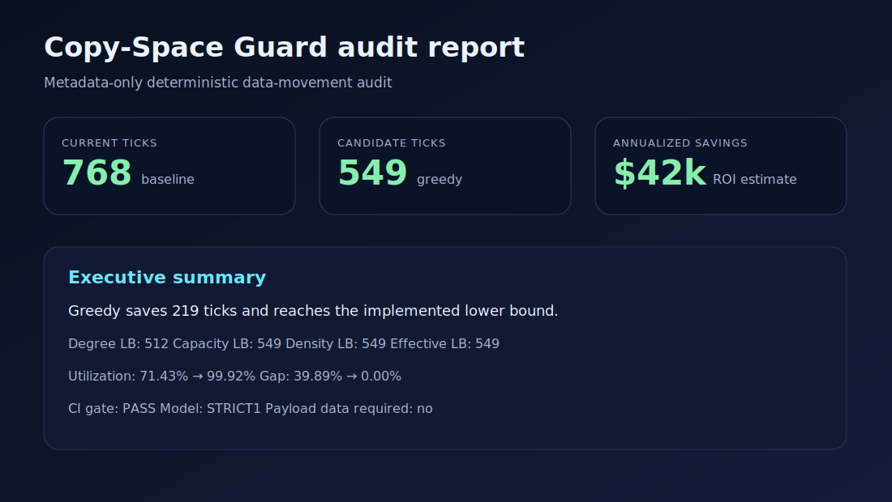

# Copy-Space Guard

[](https://github.com/bortoq/copyspace-guard/actions/workflows/ci.yml)
[](https://github.com/bortoq/copyspace-guard/actions/workflows/ci.yml)
[](https://pypi.org/project/copyspace-guard/)
[](LICENSE)
[](pyproject.toml)


**Copy-Space Guard** tells you how much time your GPU cluster wastes waiting for data transfers — without touching model weights or actual data. Give it a schedule or an NCCL log; it returns pass/fail validation, how far from optimal your plan is, and estimated savings.

Current release: **v0.2.6** on PyPI.

This package is intentionally small and easy to run locally:

- no external Python dependencies;
- no payload data required;
- deterministic output for CI and regression tracking;
- machine-readable JSON plus human-readable Markdown/HTML reports.



## Overview

> Give the tool your data-transfer plan or an NCCL log. It validates that transfers fit within slot bandwidth, shows how many ticks can be eliminated, and provides a CI gate to prevent regressions.

## Getting started

**Have real NCCL/PyTorch logs?** Best place to start.
→ [`copyspace-guard infer nccl_debug.log`](#infer-bandwidth-and-slot-count-from-logs) — extracts slots, bandwidth, and demands in one command.

```text
$ copyspace-guard infer nccl_debug.log
inferred: slots=3 bw=8589934592 bits (= max transfer size; use actual NIC bandwidth if known)
run: copyspace-guard import-nccl-log nccl_debug.log --out demands.csv --bw 8589934592 --slots 3
```

**Have an existing schedule to audit?**
→ [`copyspace-guard audit`](#commands)

**Just exploring?**
→ [Run the bundled demo](#quickstart)

### Key concepts in one sentence

- **Slots** are your GPUs or nodes. **Ticks** are rounds of communication. **bw** is bits per tick per link. A schedule is valid if every slot sends/receives at most one message per tick, and all data arrives.

## Quickstart

Install from PyPI:

```bash
python3 -m venv .venv
source .venv/bin/activate
python -m pip install copyspace-guard
copyspace-guard --version
```

Run the bundled demo:

```bash
copyspace-guard analyze \
  --csv examples/ring15.csv \
  --bw 256 \
  --id ai-staging-ring15 \
  --roi examples/roi.yml \
  --outdir artifacts/demo
```

Open:

- `artifacts/demo/report.html`
- `artifacts/demo/report.md`
- `artifacts/demo/summary.json`

Expected terminal shape:

```text
baseline: status=PASS ticks=768 lb=549 gap=0.398907 util=0.7143
greedy:   status=PASS ticks=549 lb=549 gap=0.000000 util=0.9992
saved_ticks=219 estimated_savings=9.73
```

## Primary CI Metric

For reliable CI gating at any scale, prefer `gap_vs_greedy`:

```bash
copyspace-guard audit \
  --demands demands.csv \
  --bw 256 \
  --schedule your_schedule.csv \
  --max-gap-vs-greedy 0.15
```

For small STRICT1 instances (exhaustive bound path), `--max-gap` is also exact and useful as a secondary check.

If you already have a schedule from your solver:

```bash
copyspace-guard analyze \
  --csv demands.csv \
  --bw 256 \
  --current-schedule-csv your_schedule.csv \
  --outdir artifacts/audit
```

For local development from this repository, install editable mode with development tooling:

```bash
python -m pip install -e ".[dev]"
make test
make security
```

## Input format

CSV with header:

```csv
src_slot,dst_slot,bits_total
0,1,65536
1,2,65536
```

Meaning:

- `src_slot` — source endpoint ID;
- `dst_slot` — destination endpoint ID;
- `bits_total` — transfer volume from source to destination.

Duplicate pairs are automatically merged.

## Models v0: STRICT1 and READ1_WRITE1

`STRICT1`: within one tick, each slot can participate in at most one transfer, either as source or destination.

`READ1_WRITE1`: within one tick, each slot may send at most once and receive at most once.

This is a useful baseline for:

- endpoint-limited transfer systems;
- shuffle/staging/replication analysis;
- CI regression gates;
- comparing scheduler strategies;
- first audits where full topology is not yet modeled.

It is not a universal network model. For real deployments, confirm whether the client needs extensions such as READ1_WRITE1, broadcast, topology-aware bandwidth, asymmetric links or tier-aware storage constraints.

## Scope And Limitations

`copyspace-guard` audits abstract transfer structure only.

It does not model:
- network topology;
- routing/path selection;
- asymmetric link bandwidth;
- runtime latency/jitter;
- multi-NIC/multi-queue behavior.

For large STRICT1 slot counts, `gap_to_lower_bound` can be a lower estimate only.
Use `gap_vs_greedy` as the primary CI metric in those cases.

## Commands

### Check local setup

```bash
copyspace-guard --version
copyspace-guard doctor --root .
copyspace-guard doctor --root . --json
```

### Analyze CSV and generate reports

```bash
copyspace-guard analyze --csv INPUT.csv --bw 256 --outdir artifacts/run
```

Common `analyze` options:

```bash
--slots N
--id workload-name
--notes "free text"
--cost-per-tick 0.02
--roi roi.yml
--model STRICT1  # or READ1_WRITE1
--current-schedule-csv your_schedule.csv
--current-schedule-json your_schedule.json
--summary-only
--bounds-subset-limit 20
--bounds-mode auto  # or fractional_heuristic / fractional_odd_subset
--max-errors 100
--max-demands 100000
--max-slots 10000
--max-output-ticks 1000000
```

### Audit only (no baseline/greedy run)

```bash
copyspace-guard audit \
  --demands demands.csv \
  --bw 256 \
  --schedule your_schedule.csv \
  --outdir artifacts/audit
```

Common `audit` options:

```bash
--slots N
--id workload-name
--notes "free text"
--model STRICT1  # or READ1_WRITE1
--schedule-json your_schedule.json
--bounds-subset-limit 20
--bounds-mode auto  # or fractional_heuristic / fractional_odd_subset
--max-errors 100
--max-output-ticks 1000000
--max-gap 0.15
--max-gap-vs-greedy 0.20
```

Note: `--max-gap-vs-greedy` runs deterministic `greedy` internally to compute the comparison metric.

`--bounds-subset-limit` controls exhaustive STRICT1 subset-density enumeration and is protected by a hard cap to avoid accidental exponential runs.
`--bounds-mode fractional_odd_subset` enables exact odd-subset fractional lower bounds for STRICT1 on smaller slot counts (guarded by an internal slot limit).
Bounds mode guidance:
- `auto` (default): scalable heuristics and relaxations for large slot counts.
- `fractional_heuristic`: explicit scalable odd-subset fractional heuristic mode for large slot counts.
- `fractional_odd_subset`: exact odd-subset fractional lower bound for STRICT1 with guard `slots <= 24` (alias `fractional_exact` still accepted with deprecation warning).
- Use `fractional_odd_subset` for higher-confidence small/medium runs; use `auto` for large production runs.

`report.json` also includes:
- `bounds_mode`: the mode used for bound computation.
- `bounds_complete_reason`: one of `auto_exhaustive`, `auto_partial`, `exact_fractional_mode`, `fractional_heuristic_partial`, `read1_write1_complete`.

Reason guidance:
- `auto_exhaustive`: exhaustive STRICT1 subset scan was completed; `gap_to_lower_bound` is reliable for gating.
- `auto_partial`: scalable STRICT1 heuristics were used; treat `gap_to_lower_bound` as lower estimate and prefer `--max-gap-vs-greedy`.
- `exact_fractional_mode`: exact odd-subset fractional mode was used (guarded slot limit); for `slots <= 24` it matches exhaustive `auto` lower-bound quality.
- `read1_write1_complete`: READ1_WRITE1 bound path is complete for the current model.

### Import external schedule formats

```bash
copyspace-guard import-msccl algorithm.xml --out schedule.json
copyspace-guard import-taccl taccl_output.json --out schedule.json
copyspace-guard import-csv --csv custom.csv --map tick=step --map src=from --map dst=to --map len=bits --out schedule.json
copyspace-guard import-nccl-log nccl_debug.log --out demands.csv
copyspace-guard import-pytorch-trace trace.json --out demands.csv
```

### Infer bandwidth and slot count from logs

```bash
copyspace-guard infer nccl_debug.log
copyspace-guard infer trace.json
copyspace-guard infer nccl_debug.log --out demands.csv
```

The `infer` command reads a NCCL debug log or PyTorch profiler trace, extracts
the maximum rank ID (→ `slots`) and the largest transfer size (→ `bw`), and
prints a recommended `copyspace-guard audit` invocation. Pass `--out` to also
write the demands CSV.

Bundled examples:

```bash
copyspace-guard import-msccl examples/sample_msccl.xml --out artifacts/sample_msccl_schedule.json
copyspace-guard import-taccl examples/sample_taccl.json --out artifacts/sample_taccl_schedule.json
```

Audit with an external solver plugin:

```bash
copyspace-guard audit \
  --demands demands.csv \
  --bw 256 \
  --solver-plugin my_solver.py \
  --outdir artifacts/audit
```

The solver plugin receives `instance.json` on stdin and must write `schedule.json` to stdout:

```python
#!/usr/bin/env python3
import json, sys
inst = json.load(sys.stdin)        # Instance dict
schedule = my_algorithm(inst)      # your solver
json.dump(schedule, sys.stdout)    # Schedule: {"version":0, "model":"STRICT1", "ticks":[...]}
```

See `tests/test_cli.py` (`IntegrationCliTests.test_solver_plugin_works`) for a working end-to-end example.

### Compare two external schedules

```bash
copyspace-guard compare \
  --demands demands.csv \
  --bw 256 \
  --schedule-a msccl.json \
  --schedule-b taccl.json \
  --bounds-mode auto \
  --outdir artifacts/compare
```

Interpretation:
- `schedule_a` is treated as current.
- `schedule_b` is treated as candidate.
- `saved_ticks > 0` means schedule B is faster.
- `saved_ticks < 0` means schedule B is slower.

### Validate a schedule

```bash
copyspace-guard validate artifacts/run/instance.json artifacts/run/schedule_greedy.json --bounds-mode auto --report artifacts/run/validation.json
```

### Regenerate Markdown/HTML reports

```bash
copyspace-guard report artifacts/run/summary.json --outdir artifacts/report
```

### Validate generated artifact contracts

```bash
copyspace-guard validate-artifact --kind summary artifacts/run/summary.json
```

### Run production-oriented checks

```bash
make test
make security
make production-check
```

`make test` runs ruff, mypy, compileall, unit/property/CLI tests, coverage and a CI gate smoke. `make security` runs Bandit over `src`/`tools` and `pip-audit` over the Python environment. `make production-check` runs release checks plus a small synthetic performance suite. The suite can also be run directly:

```bash
copyspace-guard bench-suite --outdir artifacts/bench-suite --max-total-seconds 30
copyspace-guard bench-bounds --outdir artifacts/bench-bounds --min-slots 32 --max-slots 256 --step-slots 32
```

`bench-bounds` parameters:
- `--patterns`: comma-separated synthetic shapes: `ring`, `pair-plus-clique`, `ring2`.
- `--bounds-subset-limit`: same STRICT1 exhaustive threshold passed to bounds code.
- `--max-case-seconds` / `--max-total-seconds`: fail when bounds runtime exceeds target.

`bench-bounds` output:
- `bench_bounds.json` with per-case elapsed time, `witness_kind`, `lower_bound_ticks`, and `bounds_complete`.
- Use this to tune defaults and identify slot ranges where new bounds passes become expensive.


## Customer/current schedule input

If you already have an actual schedule, use CSV:

```csv
tick,src_slot,dst_slot,len_bits
0,0,1,256
0,2,3,256
1,1,2,256
```

Then run:

```bash
copyspace-guard analyze \
  --csv examples/ring15.csv \
  --bw 256 \
  --current-schedule-csv customer_schedule.csv \
  --outdir artifacts/customer-run
```

You can also pass schedule JSON from an external solver:

```bash
copyspace-guard analyze \
  --csv examples/ring15.csv \
  --bw 256 \
  --current-schedule-json customer_schedule.json \
  --outdir artifacts/customer-run
```

You can also convert a schedule CSV to JSON:

```bash
copyspace-guard schedule-csv-to-json --csv customer_schedule.csv --out schedule.json
```

## CI gate command

After `analyze`, fail/pass thresholds can be checked locally or in CI:

```bash
copyspace-guard gate artifacts/demo/summary.json \
  --report greedy \
  --max-gap 0.15 \
  --max-gap-vs-greedy 0.20 \
  --min-utilization 0.85
```

Exit code `0` means pass, exit code `2` means fail.

For audit-first usage and metric interpretation (`audit_note`, `gap_vs_greedy`), see [doc/AUDIT_MODE.md](doc/AUDIT_MODE.md).
For CI wiring examples, see [doc/CI_INTEGRATION.md](doc/CI_INTEGRATION.md).

## Files generated by `analyze`

- `instance.json` — normalized workload contract.
- `schedule_baseline.json` or `schedule_customer_current.json` — current schedule artifact, unless `--summary-only` is used.
- `schedule_greedy.json` — deterministic candidate schedule, unless `--summary-only` is used.
- `schedule_baseline.csv` or `schedule_customer_current.csv` — CSV schedule artifact, unless `--summary-only` is used.
- `schedule_greedy.csv` — deterministic candidate schedule CSV, unless `--summary-only` is used.
- `report_baseline.json` or `report_customer_current.json` — validation metrics for the current schedule.
- `report_greedy.json` — validation metrics for candidate.
- `summary.json` — machine-readable comparison summary.
- `report.md` — human-readable audit report.
- `report.html` — shareable report.

## v0.2.6 boundaries

Updated v0.2.6 changes:

- HTML report now shows `gap_reliability` (exact / lower estimate) in KPI cards and a warning badge when `bounds_complete=false`;
- `bench-bounds` prints actionable recommendation by slot count;
- 13 new tests added; 183 tests total.

## v0.2.5 boundaries

Included:

- volume-based demand modeling;
- deterministic baseline and greedy schedules;
- first-class `audit` command for audit-only validation of external schedules;
- external schedule importers: `import-msccl`, `import-taccl`, `import-csv --map ...`;
- NCCL debug log and PyTorch profiler trace importers (`import-nccl-log`, `import-pytorch-trace`);
- `infer` command for auto-detecting bandwidth and slot count from NCCL/PyTorch logs;
- STRICT1 and READ1_WRITE1 validators;
- solver plugin integration (`--solver-plugin`);
- lower-bound gap and utilization metrics;
- strengthened large-`STRICT1` lower bounds (heuristic subset density, fractional odd-subset, LP-core odd-subset pass);
- external-audit interpretation fields (`audit_note`, `gap_vs_greedy`);
- practical gap metric (`gap_practical` with `--max-gap-vs-greedy`) and practical/theoretical ROI split;
- CI gate threshold for `gap_vs_greedy` via `--max-gap-vs-greedy`;
- `bounds_complete_reason` with public `BoundsReason` enum;
- `fractional_heuristic` bounds mode for scalable large-instance estimation;
- ROI estimates via `roi.yml` or a simple `$ per tick` assumption;
- real-workload examples (GPT-2 DDP, LLaMA-3, KV-cache disagg, Megatron TP AllReduce);
- `compare` command for side-by-side external schedule comparison;
- report artifacts;
- PyPI publishing through GitHub Actions Trusted Publishing;
- matrix CI for Python 3.10, 3.11 and 3.12;
- required CI checks for tests, build, Docker smoke and security scans;
- release version guard for tag/version synchronization;
- Dependabot automation for GitHub Actions updates.

Not included yet:

- topology/path selection;
- real transfer execution;
- address-level offset validation;
- VCopySpace receipt ledger integration;
- topology/path-aware importers (current importers normalize schema, but do not model network paths).

Known operational caveats:

- Customer schedule CSVs used in streaming mode must be sorted by non-decreasing `tick`.
- Full artifact mode can produce large schedule JSON/CSV files; use `--summary-only` for large pilots and CI.
- For large STRICT1 slot counts, subset-density lower bounds may be partial; check `bounds_complete` in reports.
- The greedy schedule is deterministic and useful for comparison, but it is not a proof of global optimality.
- Demand and schedule core fields are parsed as integers. Pass-through text columns in anonymized CSV outputs are prefixed with a single quote when they begin with spreadsheet formula trigger characters (`=`, `+`, `-`, `@`, tab or carriage return).

## How this maps to the larger project set

- `copyspace-guard` → scheduler, validator, lower-bound gap, CI-gate idea.
- `vcopyspace` → future enterprise layer: receipt-based metering, ledger, trace/replay, cost model.
- `DDAS` → long-term deterministic state-transition foundation.

## Project governance

- Contribution guide: [CONTRIBUTING.md](CONTRIBUTING.md)
- Governance model: [GOVERNANCE.md](GOVERNANCE.md)
- Code of conduct: [CODE_OF_CONDUCT.md](CODE_OF_CONDUCT.md)

## ROI mode

Turn saved ticks into business impact:

```bash
copyspace-guard analyze \
  --csv examples/ring15.csv \
  --bw 256 \
  --roi examples/roi.yml \
  --outdir artifacts/demo
```

Example `examples/roi.yml`:

```yaml
roi:
  tick_seconds: 1
  gpu_count_blocked: 64
  gpu_hour_cost_usd: 2.50
  runs_per_day: 12
  days_per_month: 30
```

## Gate config file

```bash
copyspace-guard gate artifacts/demo/summary.json \
  --config examples/copyspace_guard.yml
```

Example config:

```yaml
gates:
  report: greedy
  max_gap_to_lower_bound: 0.15
  min_utilization: 0.85
```

## Release automation

Tag releases are published to GitHub Releases and PyPI. Before a tag publishes, the release workflow verifies that the tag version matches both `pyproject.toml` and `copyspace_guard.__version__`.

Prepare a version bump locally:

```bash
VERSION=0.2.3 NOTE="Short release note" make bump-version
TAG=vX.Y.Z make release-guard
```

GitHub release notes are autogenerated from merged pull requests. See `doc/RELEASE_PROCESS.md` for the full process and PyPI Trusted Publishing configuration.

## Docker

```bash
docker build -t copyspace-guard .
docker run --rm --user "$(id -u):$(id -g)" -v "$PWD:/work" copyspace-guard analyze \
  --csv examples/ring15.csv \
  --bw 256 \
  --roi examples/roi.yml \
  --outdir artifacts/docker-demo
```

## Industry demos

Real-workload examples derived from published ML papers. Each example includes
a `naive_schedule.csv` (sequential, no parallelism) to compare against greedy,
showing concrete `saved_ticks` and efficiency gains.

```bash
# GPT-2 DDP AllReduce: naive sequential (8 ticks) vs parallel greedy (1 tick)
# saved_ticks=7 — 8x speedup from parallel ring scheduling
copyspace-guard analyze --csv examples/gpt2_ddp_allreduce/demands.csv \
  --bw 25000000000 --model READ1_WRITE1 \
  --current-schedule-csv examples/gpt2_ddp_allreduce/naive_schedule.csv \
  --roi examples/gpt2_ddp_allreduce/roi.yml \
  --outdir artifacts/gpt2-ddp

# LLaMA-3 70B checkpoint: star broadcast audit (gap=0 proves optimality under STRICT1)
# saved_ticks=0 — star pattern is irreducible; use READ1_WRITE1 for tree broadcast
copyspace-guard analyze --csv examples/llama3_70b_checkpoint/demands.csv \
  --bw 400000000000 --model STRICT1 \
  --roi examples/llama3_70b_checkpoint/roi.yml \
  --outdir artifacts/llama3-checkpoint

# KV-cache disaggregation: naive sequential (16 ticks) vs parallel greedy (4 ticks)
# saved_ticks=12 — 4x speedup from parallel K_{4,4} scheduling
copyspace-guard analyze --csv examples/kv_cache_disagg/demands.csv \
  --bw 50000000000 --model READ1_WRITE1 \
  --current-schedule-csv examples/kv_cache_disagg/naive_schedule.csv \
  --roi examples/kv_cache_disagg/roi.yml \
  --outdir artifacts/kv-cache-disagg

# Megatron-LM GPT-3 TP AllReduce: naive sequential (8 ticks) vs parallel greedy (1 tick)
# saved_ticks=7 — 8x speedup, largest transfer volume (16.9 GB/link)
copyspace-guard analyze --csv examples/megatron_tp_allreduce/demands.csv \
  --bw 600000000000 --model READ1_WRITE1 \
  --current-schedule-csv examples/megatron_tp_allreduce/naive_schedule.csv \
  --roi examples/megatron_tp_allreduce/roi.yml \
  --outdir artifacts/megatron-tp
```

See `examples/*/README.md` for derivation details, source citations, and
STRICT1 vs READ1_WRITE1 model comparison commands.

## Client package

See `client-package/` for a minimal package that can be sent to a customer:

- `README_CLIENT.md`
- `sample_demands.csv`
- `sample_schedule.csv`
- `roi.yml`
- `copyspace_guard.yml`
- `run_local.sh`
- `intake.md`

## Anonymize demands or schedules

```bash
copyspace-guard anonymize \
  --kind demands \
  --csv raw_demands.csv \
  --out anonymized_demands.csv \
  --mapping slot_mapping.json

copyspace-guard anonymize \
  --kind schedule \
  --csv raw_schedule.csv \
  --out anonymized_schedule.csv \
  --mapping-in slot_mapping.json \
  --mapping schedule_slot_mapping.json
```

Use `--mapping-in` when anonymizing demands and schedules that must share the same slot-ID mapping. Do not share `mapping.json` unless you intend to reveal the original endpoint names.

For large or untrusted CSVs, `anonymize` also supports `--max-rows` and `--max-file-size` as opt-in guardrails.

## Sales-oriented demos

Bad current schedule vs candidate:

```bash
copyspace-guard analyze   --csv examples/demo_bad_current_demands.csv   --bw 256   --current-schedule-csv examples/demo_bad_current_schedule.csv   --roi examples/roi.yml   --outdir artifacts/bad-current-demo
```

Conflict detection:

```bash
copyspace-guard analyze   --csv examples/demo_conflict_demands.csv   --bw 256   --current-schedule-csv examples/demo_conflict_schedule.csv   --summary-only   --outdir artifacts/conflict-demo
```

Large workloads can use `--summary-only` to avoid writing full schedule JSON/CSV artifacts. In this mode generated baseline/candidate schedules are streamed into the validator instead of materialized in memory. Customer schedule CSVs used in streaming mode must be sorted by non-decreasing `tick`.


## FAQ / Common mistakes

**Q: `copyspace-guard` shows utilization=8% — is that bad?**
A: Not necessarily. Low utilization means the schedule has idle slots, which is expected for sparse demand matrices. Focus on `gap_to_lower_bound` or `gap_vs_greedy` instead.

**Q: My saved_ticks=0 — is the tool broken?**
A: No. `saved_ticks` compares your current schedule vs a greedy candidate. If you didn't provide a `naive_schedule.csv` or your own schedule via `--current-schedule-csv`, no comparison is possible.

**Q: I get `gap_to_lower_bound=0` — is my schedule optimal?**
A: Only if `bounds_complete=true` in the report. For large STRICT1 instances, `gap_to_lower_bound` may be a lower estimate; prefer `gap_vs_greedy` as your primary CI metric.

**Q: What `--bw` value should I use?**
A: Bandwidth in bits per tick. NVLink ≈ 50 Gbps per link. InfiniBand HDR ≈ 12.5 Gbps per lane. Use the per-link bandwidth of your target system. Units are bits, not bytes — a 25 GB/s link is `--bw 200000000000`.

**Q: Can I use this with NCCL/MSCCL/TACCL schedules?**
A: Yes. Use the `import-*` commands to convert external formats into `copyspace-guard` JSON, then `audit` with `--schedule-json`.

## Model and bound details

- Model limitations: `doc/MODEL_LIMITATIONS.md`
- Lower-bound definitions: `doc/BOUNDS.md`
- JSON schemas: `doc/SCHEMAS.md`
- Artifact contracts: `doc/ARTIFACT_CONTRACTS.md`
- Performance notes: `doc/PERFORMANCE.md`
- Pilot readiness: `doc/PILOT_READINESS.md`
- Production readiness: `doc/PRODUCTION_READINESS.md`
- Operations guide: `doc/OPERATIONS.md`
- Release process: `doc/RELEASE_PROCESS.md`
- Threat model: `doc/THREAT_MODEL.md`
- Data handling: `doc/DATA_HANDLING.md`
- Changelog: `CHANGELOG.md`


## Benchmark

```bash
copyspace-guard bench   --slots 64   --bits-per-edge 1048576   --bw 1048576   --outdir artifacts/bench
```
